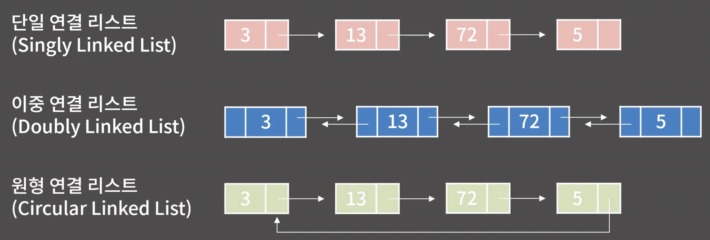
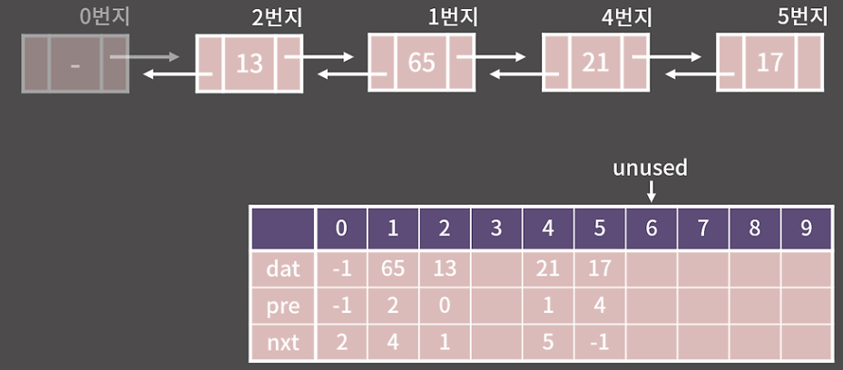

# 0x04_Linked List 
## 1. 정의와 성질
> **정의** : 원소들을 저장할 때 그 다음 원소가 있는 위치(주소)를 포함시키는 방식으로 저장하는 자료구조. 메모리상에서 원소들은 배열과 달리 흩어져있음.

### 성질 
1. k번째 원소를 찾기 위해 **O(k)** 의 시간이 필요. 
    - 맨 앞 원소에서 부터 찾아나가야 하기 때문
2. 임의의 위치에 있는 원소 추가 or 제거 - **O(1)** 
3. 메모리 상에 데이터들이 연속해있지 않음 - Cache hit rate가 낮음 - but, 할당이 쉬움

### 연결리스트의 종류

1. **Singly Linked List - 단일 연결리스트**
- 각 원소는 자신의 다음 원소의 주소만을 가지고 있음

2. **Doubly Linked List - 이중 연결 리스트**
- 각 원소가 자신의 이전 원소와 다음 원소의 주소 둘 다 들고 있음.

3. **Cicular Linked List - 원형 연결 리스트**
- 끝이 처음과 연결되어 있음.

### 배열 vs 연결리스트 
|                     | 배열        | 연결 리스트      |
|---------------------|------------|------------------|
| k번째 원소의 접근   | O(1)       | O(k)             |
| 임의 위치에 원소 추가/제거 | O(N) | O(1)             |
| 메모리 상의 배치    | 연속       | 불연속           |
| 추가적으로 필요한 공간 <br> (Overhead) | - | O(N)         |
- 추가적으로 필요한 공간 같은 경우 연결리스트에서는 각 원소가 가지고 있어야 할 주소값의 크기만큼 더 필요하다. 32비트(4byte) 컴퓨터라면 4N만큼, 64비트(8byte) 컴퓨터라면 8N만큼 더 필요하다.

> [!Note]\
> 두 자료구조는 메모리 상에 원소를 놓는 방법은 다르지만 원소들 사이의 선후관계가 일대일로 정의 됨, 따라서 ***선형자료구조***로 불린다.

## 2. 기능과 구현
1.  **임의의 위치에 있는 원소를 확인/변경 - O(N)**
- k번째 원소를 보기 위해 걸리는 시간 - O(k) 
- 전체 원소가 N이라 하면 평균적으로 걸리는 시간 - N/2 
2.  **임의의 위치에 원소를 추가/제거 - O(1)**
- 추가하고 싶은 위치의 주소를 알고있을 경우 - **O(1)**
    - 배열처럼 그 뒤의 원소를 모두 옮기는 작업을 할 필요가 없기 때문에.
    - 추가하고자 하는 원소의 위치를 모를 때는 세번째 원소까지 찾아가야 하는 시간이 추가로 걸림 

### 사용 예시
- 텍스트 에디터 : 커서를 옮기고 글자를 지우는 것과 같은 연산들이 다양하게 주어진 후 최종결과를 출력하라는 문제라면 임의의 위치에 글자를 추가/제거하는 연산들이 효울적으로 수행되어야 하기에 연결리스트가 효율적일 수 있음.

### 연결리스트의 구현 (야매로 구현하거나 stl을 사용하자)
1. 야매 연결리스트 구현 
- 구조 시각화

    - 0번지 : dummyNode를 관념적으로 둔다. 예외처리에 용이함.
    - `pre`는 이전 원소가 있는 주소, `dat`는 해당 주소에 들어있는 값, `nxt` 다음 원소가 있는 주소.

- **traverse 구현(모든 원소를 출력)**
```cpp
void traverse(){
  int cur = nxt[0];
  while(cur != -1){
    cout << dat[cur] << ' ';
    cur = nxt[cur];
  }
  cout << "\n\n";
}
```
- **insert 구현**
```cpp
void insert(int addr, int num){
    dat[unused] = num; // 새로운 원소 생성
    pre[unused] = addr; // 새 원소의 pre에 삽입할 위치의 주소 대입
    nxt[unused] = nxt[addr]; // 새 원소의 nxt에 삽입할 위치의 nxt대입
    if (nxt[addr] != -1) pre[nxt[addr]] = unused; 
    nxt[addr]= unused;
    // 삽입할 위치의 nxt값과 
    // 삽입할 위치의 다음 원소의 pre값을 새 원소로 변경
    unused++; // unused 1증가 
}
```
- **erase 구현**
```cpp
void erase(int addr){
    nxt[pre[addr]] = nxt[addr]; //이전 위치의 nxt를 삭제할 위치의 nxt로 변경
    if (nxt[addr] != -1) pre[nxt[addr]] = pre[addr]; //다음 위치의 pre를 삭제할 위치의 pre로 변경
}
```
## 3.STL List
- **`push_back()`,`pop_back()`,`push_front()`,`pop_front()`**
    - 시간 복잡도 : O(1)
    - std::list::iterator 사용해야함
- **`erase()`**
    - 제거한 다음 원소의 위치를 반환함
- **`list.end()`**
    - 더미노드로서 제일 뒤 원소의 한 칸 뒤를 가리킨다.

## 4. 연습문제 - BOJ_1406:에디터 , 손코딩 문제
### 손코딩 문제 
1. 원형 연결리스트 내의 임의의 노드 하나가 주어졌을 때 해당 List의 길이를 효율적으로 구하는 방법? 
    - 정답 : 동일한 노드가 나오기 전까지 계속 다음노드로 간다. 
    - 공간복잡도-**O(1)**, 시간복잡도-**O(N)**

2. 중간에 만나는 두 연결리스트의 시작점들이 주어졌을때 만나는 지점을 구하는 방법?
    - 정답 : 두 시작점에대해 끝까지 한 번 돌아서 각각의 길이를 구한 후, 더 긴 쪽을 둘의 차이만큼 앞으로 이동시키고 두 시작점이 만날 때까지 두 시작점을 동시에 한 칸씩 전진. 
    - 공간복잡도-**O(1)**, 시간복잡도-**O(A+B)**
    
3. 주어진 연결리스트 안에 사이클이 있는지 판단.
    - 정답 : **`Floyd's cycle-finding algorithm`**
    - 한 칸씩 가는 커서와 두 칸씩 가는 커서를 동일한 시작점에서 출발시키면 사이클이 있을 경우 두 커서는 반드시 만난다. 반대로 만약 사이클이 없으면 두 커서가 만나지 못하고 연결 리스트의 끝에 도달한다.
    - 공간복잡도-**O(1)**
