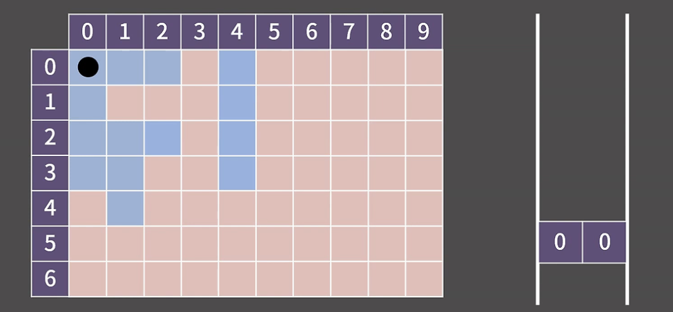
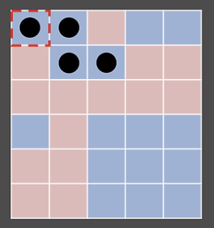
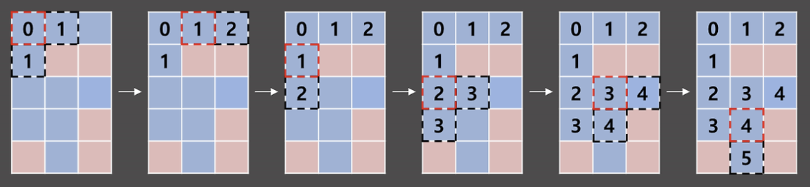
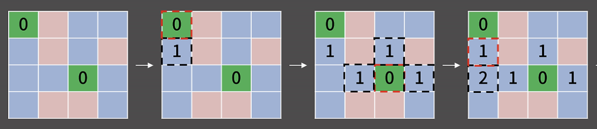

# 0x09_BFS
## 0x00 알고리즘 설명

### 활용예시
- 그림판에서 윤곽선으로 둘러 싸인 내부를 한 번에 색칠하는 기능인 `Flood Fill` 을 구현할 때 → BFS 사용!

### BFS ( Breadth First Search )
- 다차원 배열에서 각 칸을 방문할 때 **너비**를 우선으로 방문하는 알고리즘

## 0x01 예시

- 아래의 그림에서 (0,0) 과 상하좌우로 이어진 모든 파란칸을 칠하고자 한다. 이 문제를 BFS로 해결한다.


1. 시작하는 칸을 큐에 넣고 방문했다는 표시를 남김.
2. 큐에서 원소를 꺼내 그 칸에 상하좌우로 인접하나 칸에 대해서만 3번을 진행
3. 해당 칸을 이전에 방문했다면 아무것도 하지 않고, 처음 방문했다면 방문했다는 표시를 남기고 해당 칸을 큐에 삽입.
4. 큐가 빌 때 까지 2번을 반복

- **시간 복잡도** : 모든 칸이 큐에 1번씩 들어가므로 칸이 N개 일 때 ***O(N)***

### 구현 코드 
```cpp
#include <bits/stdc++.h>
using namespace std;
#define X first
#define Y second // pair에서 first, second를 줄여서 쓰기 위해서 사용
int board[502][502] =
{{1,1,1,0,1,0,0,0,0,0},
 {1,0,0,0,1,0,0,0,0,0},
 {1,1,1,0,1,0,0,0,0,0},
 {1,1,0,0,1,0,0,0,0,0},
 {0,1,0,0,0,0,0,0,0,0},
 {0,0,0,0,0,0,0,0,0,0},
 {0,0,0,0,0,0,0,0,0,0} }; // 1이 파란 칸, 0이 빨간 칸에 대응
bool vis[502][502]; // 해당 칸을 방문했는지 여부를 저장
int n = 7, m = 10; // n = 행의 수, m = 열의 수
int dx[4] = {1,0,-1,0};
int dy[4] = {0,1,0,-1}; // 상하좌우 네 방향을 의미
int main(void){
  ios::sync_with_stdio(0);
  cin.tie(0);
  queue<pair<int,int> > Q;
  vis[0][0] = 1; // (0, 0)을 방문했다고 명시
  Q.push({0,0}); // 큐에 시작점인 (0, 0)을 삽입.
  while(!Q.empty()){
    pair<int,int> cur = Q.front(); Q.pop();
    cout << '(' << cur.X << ", " << cur.Y << ") -> ";
    for(int dir = 0; dir < 4; dir++){ // 상하좌우 칸을 살펴볼 것이다.
      int nx = cur.X + dx[dir];
      int ny = cur.Y + dy[dir]; // nx, ny에 dir에서 정한 방향의 인접한 칸의 좌표가 들어감
      if(nx < 0 || nx >= n || ny < 0 || ny >= m) continue; // 범위 밖일 경우 넘어감
      if(vis[nx][ny] || board[nx][ny] != 1) continue; // 이미 방문한 칸이거나 파란 칸이 아닐 경우
      vis[nx][ny] = 1; // (nx, ny)를 방문했다고 명시
      Q.push({nx,ny});
    }
  }
}
```
> [!Waring]\
> BFS구현시 많이 하는 실수 
>> 1. 시작점에 방문헀다는 표시를 누락.
>> 2. 큐에 넣을 때 방문했다는 표시를 하지 않고 뺄 때 방문했다는 표시를 남김.
>> 3. 이웃한 원소(nx, ny)가 범위를 벗어났는지에 대한 체크를 잘못 수행함.

### BOJ 1926번 : 그림 [🔗](https://www.acmicpc.net/problem/1926)

- 이 문제는 크게 두가지를 수행하면 된다.
1. 상하좌우로 연결된 그림의 크기를 알아내기
2. 도화지에 있는 모든 그림을 찾아내기

- 1번 같은 경우 bfs를 돌면 되고, 2번은 이중 for문을 돌면서 bfs의 시작점이 될 수 있는지를 체크해주면 된다.
- 시간 복잡도 : 칸의 개수만큼 필요 -> ***O(nm)***

## 0x02 응용1 - 거리 측정
### BOJ 2178번 : 미로 탐색 [🔗](https://www.acmicpc.net/problem/2178)

- 미로 탐색문제는 다음과 같이 방문했다는 표시(vis 배열) 대신 시작점으로 부터의 거리(dist 배열)를 남겨 거리와 방문여부를 모두 확인 할 수 있도록 짜면 된다.

## 0x03 응용2 - 시작점이 여러개인 경우 
### BOJ 7576번 : 토마토 [🔗](https://www.acmicpc.net/problem/7576)

- 처음에 모든 시작점을 큐에 넣고 bfs를 돌리면 된다.
- 마지막에 답을 출력할 땐 거리가 가장 먼 것을 찾지만 익지 않은 토마토가 있는지를 꼭 확인해줘야 한다.

## 0x04 응용3 - 시작점이 두 종류일  때
### BOJ 4179번 : 불! [🔗](https://www.acmicpc.net/problem/4179)


## 0x05 응용4 - 1차원에서의 BFS
### BOJ 1697번 : 숨바꼭질 [🔗](https://www.acmicpc.net/problem/1697)